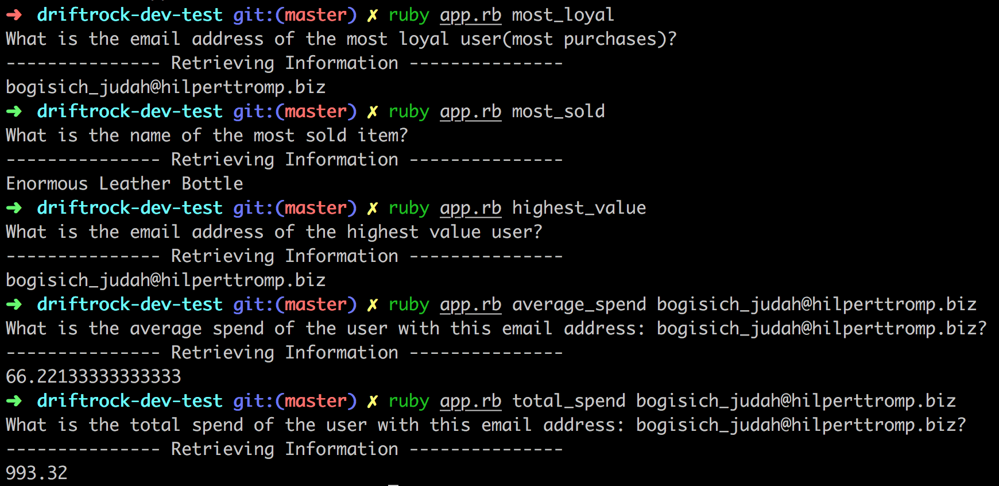

Driftrock Developer Test
========================

## Approach

#### TDD the building of these key features:
- a script that will run in the command line taking one parameter as a command to select which question it will answer

- the script should implement:
- total_spend [EMAIL]: "What is the total spend of the user with this email address[EMAIL]?"
To get total spend of a certain user using email:
1. Find Users id by searching users with email.
2. Search for all purchases with that user_id
3. Sum all purchases with that user_id

- average_spend[EMAIL]: "What is the average spend of the user with this email address [EMAIL]?"
- most_loyal: "What is the email address of the most loyal user(most purchases)?"
- highest_value: "What is the email address of the highest value user?"
1. find all user ids
2. map total spend for each id - into hash.
3. select maximum spend - return user information with user_id

- most_sold: "What is the name of the most sold item"

e.g.
```
$ ruby app.rb total_spend drift.rock@email.com
22.98
$ ruby app.rb most_loyal drift.rock@email.com
```

- A call trying to access the data of ALL purchases or ALL users should run (loop) WHILE checking the number of elements returned on each page. WHEN the number of users or purchases returned is less than the total requested per page - the loop should finish as this is the end of the available data.(Since the only way to know you've reached the end is that the number of entries returned is less than the amount requested per page)


## To Run

- clone repository

```
git clone git@github.com:tobywinter/driftrock-dev-test.git
```

Once in the driftrock-dev-test directory

- run bundler

```
bundle install
```

- run the tests

```
rspec
```

- run the App in the console with a command to select your query

e.g.
```
ruby app.rb highest_value
// returns the email address of the highest value user


ruby app.rb most_sold
// returns the name of the most sold item

ruby app.rb most_loyal
// returns email address of the user with the most purchases

ruby app.rb total_spend email@address.com
// returns the total spend of the user registered with the email 'email@address.com'

ruby app.rb average_spend email@address.com
// returns the average spend of the user registered with the email 'email@address.com'
```


## Screenshots
#### Running and Displaying Results


## Improvements

- Some of the methods in ApiClient are large and need refactoring
- I want to extract a Users a Purchases and a Queries/Calculator class from ApiClient - aim for single responsibility of each class as I am not satisfied with the structure - it could be much more extendable than it currently is.
- If I were to build it again I would extract to other classes much sooner
- I would consider if it would be useful to save the data from the api somewhere and just update it when it's called again, calling for the full amount takes a lot of time and means some of the queries are quite slow.
